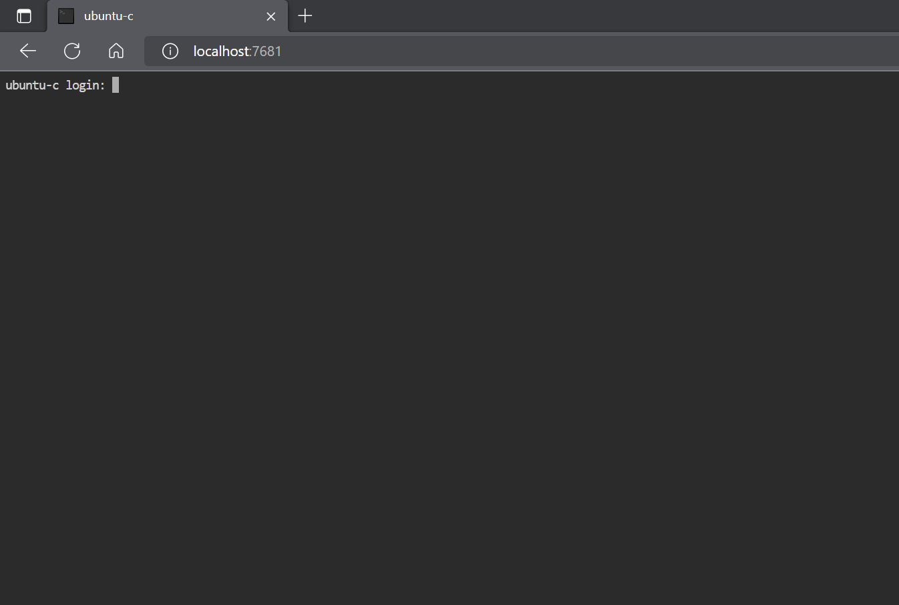
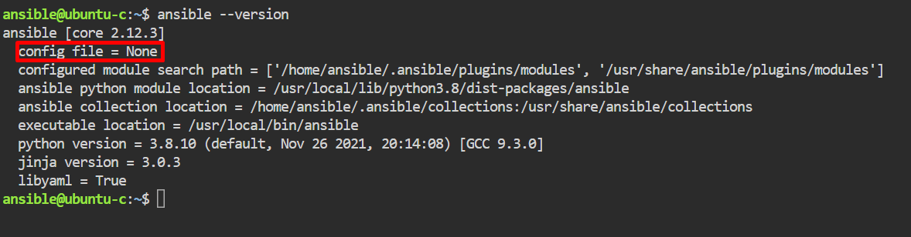
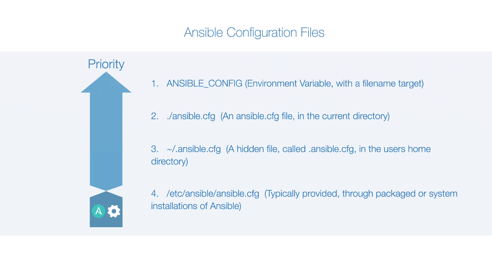
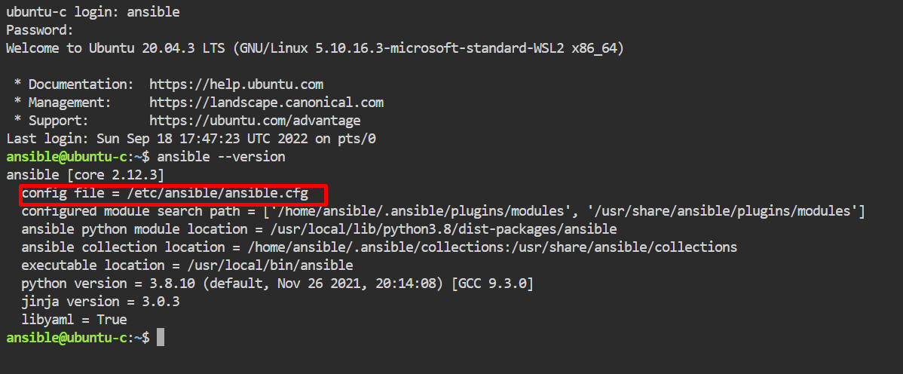

# Ansible Lab
Ansible commands, snippets and recipes for learning purpose

This tutorial uses Ansible Lab provided by [Dive Into Ansible](https://diveinto.com/)

If you prefer to install your own environment, please refer to [Installing Ansible](https://docs.ansible.com/ansible/latest/installation_guide/intro_installation.html?extIdCarryOver=true&sc_cid=701f2000001OH7YAAW).

**Index**

- [Ansible Lab](#ansible-lab)
  - [Starting the Lab](#starting-the-lab)
  - [Using the Lab](#using-the-lab)
  - [Check Ansible Version](#check-ansible-version)
  - [Ansible Configuration File](#ansible-configuration-file)
    - [Creating a Priority 4 configuration file](#creating-a-priority-4-configuration-file)
    - [Setting host_key_checking to false](#setting-host_key_checking-to-false)
  - [Copying the password to instances](#copying-the-password-to-instances)
  - [Test connectivity ty your instances](#test-connectivity-ty-your-instances)

## Starting the Lab
  ```bash
  cd diveintoansible-lab
  docker compose up
  ```

## Using the Lab
1. Type localhost:1000 into your browser. You will see the lab home page.
  
2. Select Ubuntu-c
  
3. You will see a terminal like screen
   
4. Login with user ansible and password password

## Check Ansible Version
1. To check the version just type the following command:
    
    ```bash
    ansible --version
    ```
2. Note that Ansible is not using a configuration file.
   
   
## Ansible Configuration File
Ansible uses a configuration file that can be set in many places. Each path containing a configuration file determines the priority configuration Ansible will respect. 


### Creating a Priority 4 configuration file
1. Create a configuration file with the commands bellow:
       
    ```bash
    sudo mkdir /etc/ansible
    sudo touch /etc/ansible/ansible.cfg
    ```
2. Logout and login again.
3. Type ansible --version and check the configuration file is set. 

    

### Setting host_key_checking to false
Setting host_key_checking to false will prevent fingerprint check on a new host. 

1. Edit your ansible.cfg file and add the following line
    ```ini
    host_key_checking=false
    ```
2. Save and exit the file.
3. Logout and login again
## Copying the password to instances
This procedure helps to send commands through ssh without the need to inform your password every time. 
1. Install sshpass
   
    ```bash
    sudo apt update
    sudo apt install sshpass
    ```
2. Create an ssh key pair
   
   ```bash
   ssh-keygen
   ```

3. Press enter to confirm each default option until the command finishes. 
   
4. Create a password file with text password
    ```bash
    echo password > password.txt
    ```
5. Create a shell script with name copy-password.sh
    ```bash
    vi copy-password.sh
    ```
6. Paste the following content
    ```bash
    #!/bin/bash
    for user in ansible root
    do
      for os in ubuntu centos
      do
        for instance in 1 2 3
        do
          sshpass -f password.txt ssh-copy-id -o StrictHostKeyChecking=no ${user}@${os}${instance}
        done
      done
    done
    ```

    > The StrictHostKeyChecking=no prevents ssh to ask for fingerprint 
    > confirmation. 
7. Save the file and exit vi.
8. Execute the script
    ```bash
    ./copy-password.sh
    ```

## Test connectivity ty your instances
1. Type in the following command to create your inventory and send a ping command to all instances.
    ```bash
    ansible -i,ubuntu1,ubuntu2,ubuntu3,centos1,centos2,centos3 all -m ping
    ```
    
    > **Note**: the *ansible -i* command creates an inventory 
    > and expect you to inform a file but instead you can send 
    > the content of the file just by typing a comma right 
    > after the i. The *all* parameter specifies that we will  
    > use all instances. The *-m ping* specifies the module 
    > that we will use. 
2. The output should be similar to the example bellow:
    ```bash
    ubuntu3 | SUCCESS => {
    "ansible_facts": {
        "discovered_interpreter_python": "/usr/bin/python3"
    },
    "changed": false,
    "ping": "pong"
    }
    ubuntu2 | SUCCESS => {
        "ansible_facts": {
            "discovered_interpreter_python": "/usr/bin/python3"
        },
        "changed": false,
        "ping": "pong"
    }
    ubuntu1 | SUCCESS => {
        "ansible_facts": {
            "discovered_interpreter_python": "/usr/bin/python3"
        },
        "changed": false,
        "ping": "pong"
    }
    centos1 | SUCCESS => {
        "ansible_facts": {
            "discovered_interpreter_python": "/usr/libexec/platform-python"
        },
        "changed": false,
        "ping": "pong"
    }
    centos2 | SUCCESS => {
        "ansible_facts": {
            "discovered_interpreter_python": "/usr/libexec/platform-python"
        },
        "changed": false,
        "ping": "pong"
    }
    centos3 | SUCCESS => {
        "ansible_facts": {
            "discovered_interpreter_python": "/usr/libexec/platform-python"
        },
        "changed": false,
        "ping": "pong"
    }
    ```

